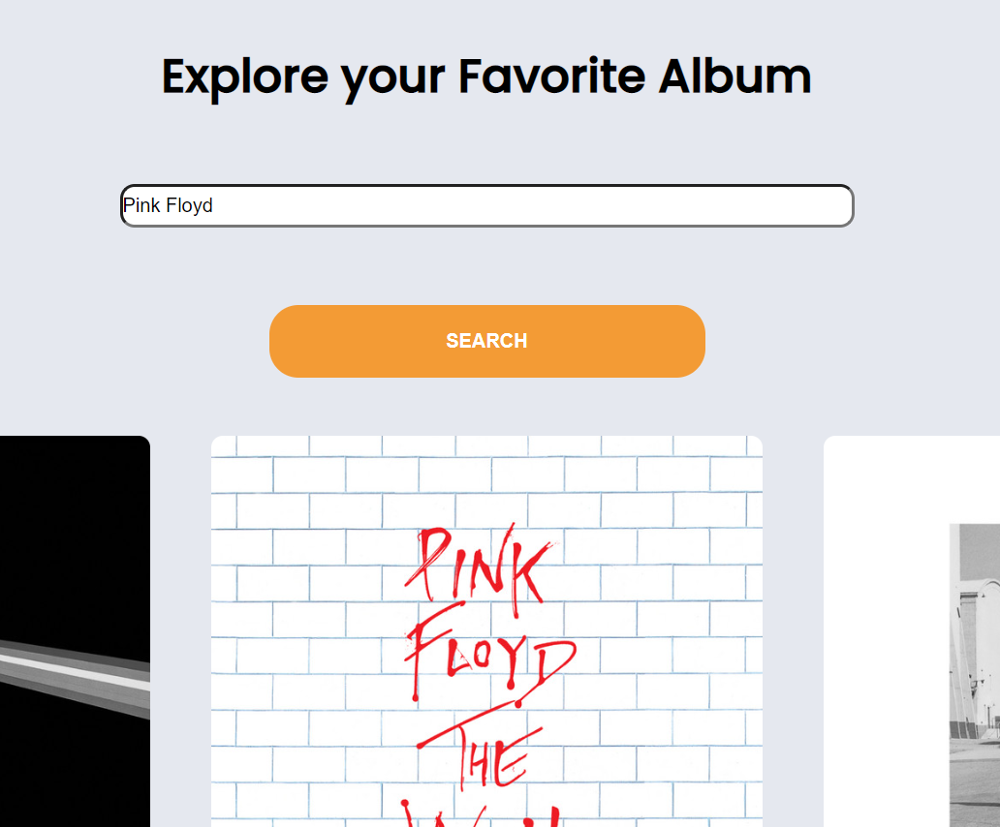
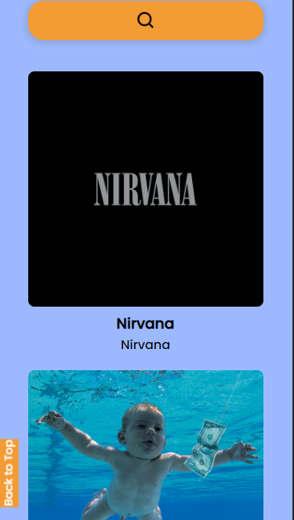

# AlbumSpotter




## Description

AlbumSpotter is a cutting-edge Single Page Application (SPA) designed to fulfill all your music discovery and listening needs. With a seamless and intuitive user interface, AlbumSpotter allows you to explore and find your favorite albums by album name or artist name, while also providing the ability to listen to songs from those albums. It's the perfect platform for music enthusiasts who want to dive deep into their favorite artists' discographies or discover new albums from talented musicians across various genres.

[Click here for the Demo version](https://nurlanimamali95.github.io/AlbumSpotter/)

## Code structure

```

assets
public
  └── styles.css
src
  └── API
       └── api.js
  └── pages
        └── bodyColorChange.js
        └── errorHandling.js
        └── overlay.js
  └── app.js
index.html
package-loc.json
package.json
README.md
```

### 2.1 Client structure

- `assets` || images that were used in the app and also in README.md
- `public` || css file for styling the whole page
- `src` || It contains two folders API and pages
- `API` || As you already understood, this folder for APIs. I created fetch in three different functions, so it is easy to access them later. There is one file inside of this folder which is `api.js`
- `pages` || JS files that handles errors, apply styles and add components
- `app.js` || The main JS file that connected directly to `index.html` and imports the other modules.
- `index.html` || HTML file, main structure of the app.

## Made with:


&nbsp;&nbsp;&nbsp&nbsp;&nbsp;&nbsp&nbsp;&nbsp;&nbsp&nbsp;&nbsp;&nbsp&nbsp;&nbsp;&nbspv&nbsp;&nbsp;&nbsp&nbsp;&nbsp;&nbsp&nbsp;&nbsp;&nbsp&nbsp;&nbsp;&nbsp
&nbsp;&nbsp;&nbsp&nbsp;&nbsp;&nbsp&nbsp;&nbsp;&nbsp&nbsp;&nbsp;&nbsp&nbsp;&nbsp;&nbsp&nbsp;&nbsp;&nbsp&nbsp;&nbsp;&nbsp&nbsp;&nbsp;&nbsp&nbsp;&nbsp;
&nbsp;&nbsp;&nbsp&nbsp;&nbsp;&nbsp

&nbsp;&nbsp;&nbsp&nbsp;&nbsp;&nbsp

